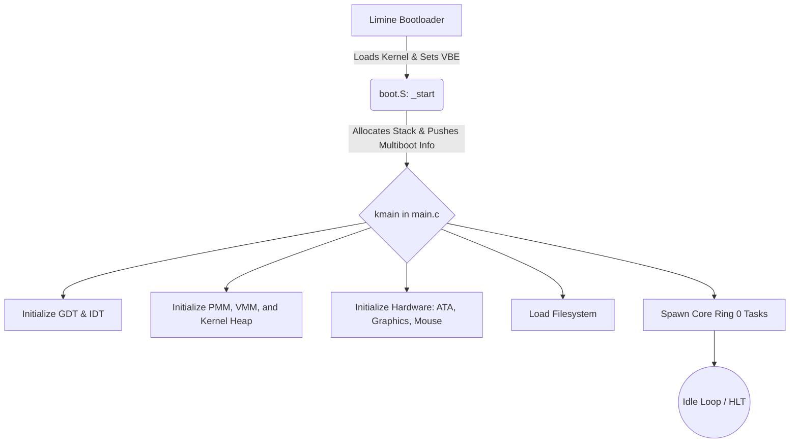
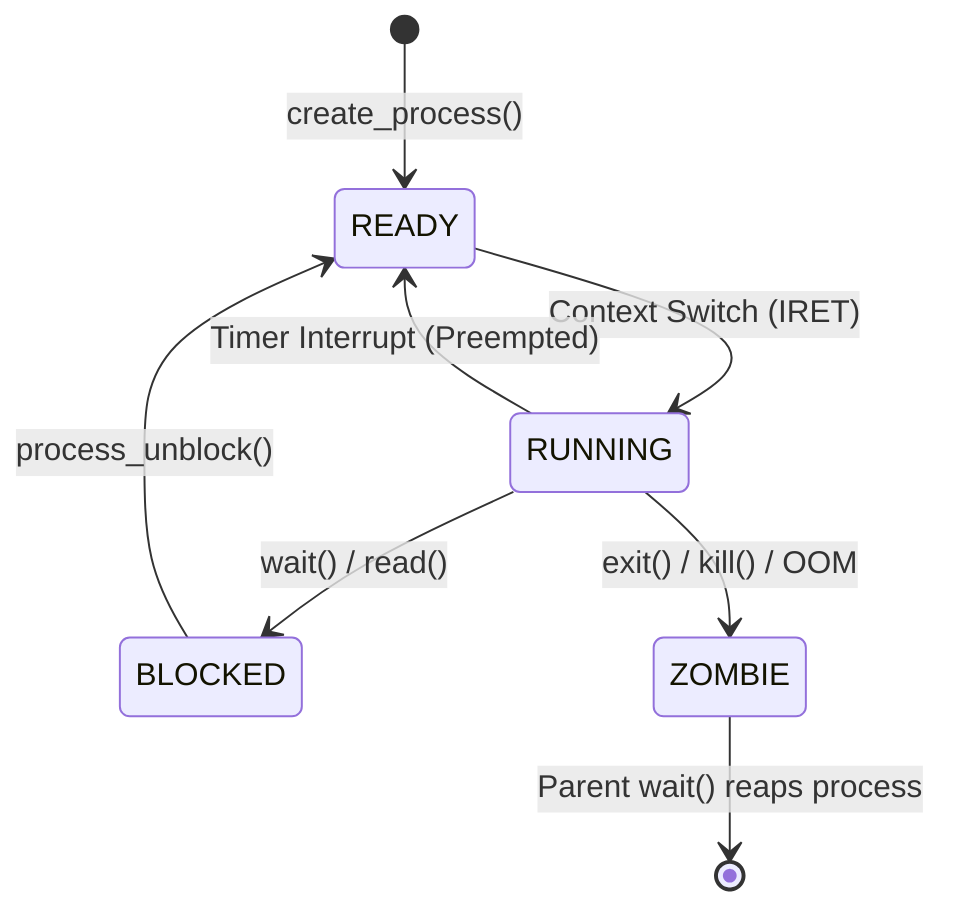

# System Architecture & Boot Sequence

OSForNerds is a classic monolithic kernel. It handles hardware abstraction, memory virtualization, and process scheduling, providing a syscall interface to unprivileged userland applications.

## Boot Sequence

The system is booted via Limine using the Multiboot1 protocol. Limine prepares the protected mode environment, sets up the VBE framebuffer, and hands control over to the assembly entry point.

## Memory Management

The memory model enforces strict isolation between the kernel and user processes using 32-bit x86 paging (Page Directories and Page Tables).

### Virtual Memory Map

| Virtual Address Range | Size | Privilege | Description |
| --- | --- | --- | --- |
| `0x00000000` - `0x07FFFFFF` | 128 MB | Ring 0 | Identity mapped physical memory (Kernel space). |
| `0x00200000` | Variable | Ring 0 | Kernel `.text`, `.data`, and `.bss` (from `linker.ld`). |
| `0x10000000` | Variable | Ring 3 | ELF binary entry point for Userland applications. |
| `0xBFFF0000` - `0xBFFFF000` | 64 KB | Ring 3 | Userland Process Stack (Grows downwards). |
| `0xD0000000` - `0xD1FFFFFF` | 32 MB | Ring 0 | Kernel Heap (`kmalloc`/`kfree`). |

### Address Space Isolation (VMM)
When `vmm_create_address_space()` creates a Ring 3 process, the kernel allocates a new Page Directory. To keep the kernel accessible during hardware interrupts and syscalls, the bottom 128 MB (indices 0–31) and the top 1 GB (indices 768–1023) of the kernel's Page Directory are mirrored into the user process's Page Directory. These shared pages lack the `I86_PTE_USER` flag, so Ring 3 code triggers a Page Fault if it tries to access them directly.

### Physical Memory Manager (PMM)

The PMM uses a bitmap to track physical 4KB frames. It scans the Multiboot memory map to protect reserved regions and manages free frames for the VMM and Heap.

## Process Scheduling

The OS uses a **Preemptive Round-Robin Scheduler**. It relies on the Programmable Interval Timer (PIT) mapped to IRQ0 (INT 32) to force context switches.

### Process Lifecycle

When switching to a Ring 3 process, the kernel crafts a fake interrupt stack frame with user-mode segment selectors (`0x23` for data, `0x1B` for code) and executes an `iret` to drop CPU privilege levels.

