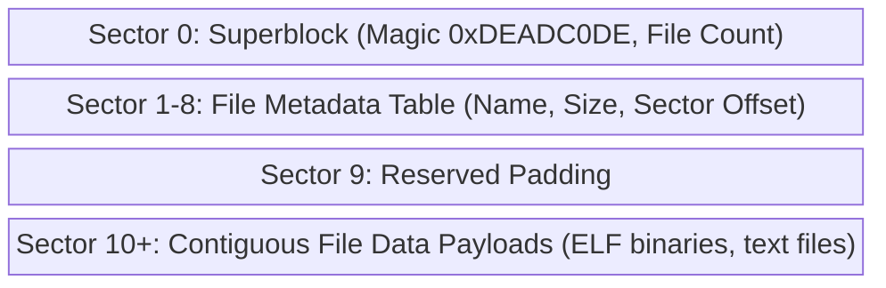

# Virtual Filesystem (VFS) & Storage

The system uses a custom flat filesystem built for fast in-memory parsing, backed by an ATA PIO disk driver.

## Disk Layout structure

The storage device (`disk.img`) is formatted during the build process via `build_fs.py`. It is structured into fixed sectors (512 bytes each).

## VFS In-Memory Representation

Upon boot, the kernel reads the File Metadata Table and constructs an in-memory Virtual File System (VFS) tree consisting of `file_t` nodes.

* **RAM Cached:** Files are loaded entirely into kernel memory for fast reads.
* **Modifications:** When a file is altered or created, the changes are applied to the RAM tree.
* **Persistence:** `fs_save_to_disk()` flattens the RAM tree and overwrites the disk metadata table and data sectors linearly to preserve state across reboots.

## The ATA Driver

The storage backend communicates with the Primary Master IDE drive via I/O ports (`0x1F0` - `0x1F7`) using Programmed Input/Output (PIO).

To keep the system stable during preemptive multitasking, ATA read/write operations lock a spinlock (`ata_lock`) and call `schedule()` while polling the drive's `BSY` and `DRQ` status registers.
