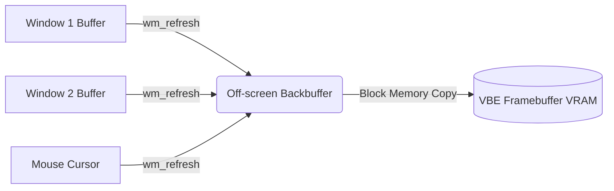

# Window Manager & Compositing Subsystem

OSForNerds has a custom hardware-accelerated 2D compositor. It uses a double-buffered architecture for glitch-free window dragging, overlapping, and text rendering.

## The Compositor Pipeline

To stop visual tearing, no rendering goes directly to the screen. All UI elements are drawn to an off-screen backbuffer in system RAM. A background compositor task blits the final backbuffer to the physical VRAM framebuffer.

## Window Architecture

The `window_t` structure represents windows. Each window operates as an independent visual and interactive container.

* **Isolation:** Each window has its own pixel buffer array (`uint32_t *buffer`) allocated from a dedicated memory pool.
* **Master-Stack Tiling:** The WM automatically recalculates tile sizes and positions dynamically as windows are spawned and destroyed. It uses a strict master-stack layout: the primary application occupies the left half of the screen, while all subsequent windows are stacked vertically on the right half.
* **Input Routing:** Each window maintains its own 256-byte circular keyboard buffer. Global keyboard interrupts route keystrokes exclusively to the currently active window's buffer.
* **Text Rendering:** An embedded 8x8 basic VGA bitmap font is used for high-speed pixel manipulation via `draw_char`.

## Interactions

Userland applications do not interact directly with VRAM. They use system calls (`SYS_CREATE_WINDOW`, `SYS_DRAW_RECT`, `SYS_WIN_PRINT`) to ask the kernel to mutate their specific window buffer.

